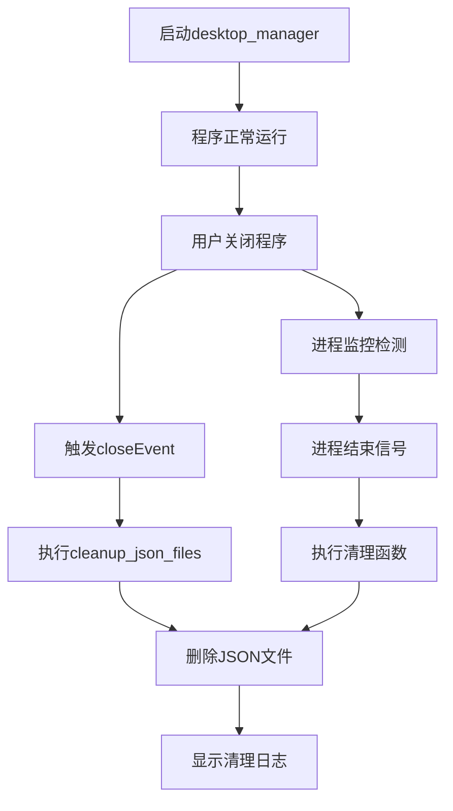

# JSON文件自动清理功能说明

## 📋 功能概述

当用户关闭desktop_manager时，系统会自动删除以下JSON文件：
- `received_data.json` - 从前端接收的原始数据文件
- `received_tasks.json` - 处理后的任务数据文件  
- `received_tasks.json.notified_*` - 所有任务通知备份文件

## 🔧 实现方式

### 1. 内置清理功能
**desktop_manager.py** 现在包含内置的JSON文件清理功能：
- 在 `closeEvent` 中自动执行清理
- 在 `exit_application` 中双重保险清理
- 提供详细的清理日志

### 2. 进程监控清理
**fullscreen_browser.py** 包含进程监控功能：
- 实时监控desktop_manager进程状态
- 当进程结束时自动触发清理
- 支持异常处理和错误恢复

### 3. 独立监控脚本
提供多个独立脚本确保清理功能正常工作：
- `start_with_cleanup.py` - 带监控的启动脚本
- `manual_cleanup.py` - 手动清理工具
- `simple_test.py` - 功能测试脚本

## 🚀 使用方法

### 方法一：正常使用（推荐）
直接使用desktop_manager，现在已内置清理功能：
```bash
python desktop_manager.py
```

### 方法二：使用监控启动器（最安全）
使用带监控的启动脚本：
```bash
python start_with_cleanup.py
```

### 方法三：手动清理
如果自动清理失败，可以手动清理：
```bash
# 交互式清理
python manual_cleanup.py

# 自动清理
python manual_cleanup.py --auto

# 仅检查文件
python manual_cleanup.py --check
```

## 🔍 故障排除

### 问题1：JSON文件未被删除
**解决方案：**
1. 使用手动清理工具：
   ```bash
   python manual_cleanup.py --auto
   ```

2. 检查文件状态：
   ```bash
   python manual_cleanup.py --check
   ```

3. 使用监控启动器：
   ```bash
   python start_with_cleanup.py
   ```

### 问题2：进程监控不工作
**可能原因：**
- desktop_manager崩溃退出
- 进程被强制终止
- 权限问题

**解决方案：**
1. 查看终端输出的错误信息
2. 使用管理员权限运行
3. 手动执行清理

### 问题3：文件被占用无法删除
**解决方案：**
1. 关闭所有相关程序
2. 等待几秒后重试
3. 重启系统后清理

## 🧪 测试功能

运行测试脚本验证清理功能：
```bash
python simple_test.py
```

预期输出：
```
🎉 所有测试通过!
```

## 📁 相关文件

| 文件名 | 功能 | 类型 |
|--------|------|------|
| `desktop_manager.py` | 主程序（已添加清理功能） | 核心文件 |
| `fullscreen_browser.py` | 浏览器（已添加进程监控） | 核心文件 |
| `start_with_cleanup.py` | 带监控的启动器 | 工具脚本 |
| `manual_cleanup.py` | 手动清理工具 | 工具脚本 |
| `simple_test.py` | 功能测试脚本 | 测试脚本 |

## 🔄 工作流程



## ⚙️ 配置选项

在`desktop_manager.py`中可以配置：
- 是否启用自动清理（默认启用）
- 清理的文件类型
- 日志输出级别

在`fullscreen_browser.py`中可以配置：
- 进程监控间隔（默认500ms）
- 监控超时时间
- 错误处理方式

## 📝 日志示例

正常清理日志：
```
🔔 Desktop Manager 正在关闭，开始清理JSON文件...
🧹 开始清理JSON文件...
   当前工作目录: E:\项目\新建文件夹
🔍 检查文件: E:\项目\新建文件夹\received_data.json
✅ 已删除JSON文件: received_data.json
🔍 检查文件: E:\项目\新建文件夹\received_tasks.json
✅ 已删除JSON文件: received_tasks.json
🔍 扫描备份文件目录: E:\项目\新建文件夹
🔍 找到 1 个备份文件
✅ 已删除备份文件: received_tasks.json.notified_1750097010
🧹 JSON文件清理完成，共删除 3 个文件:
   - received_data.json
   - received_tasks.json
   - received_tasks.json.notified_1750097010
```

## 💡 最佳实践

1. **推荐使用方式**：使用 `start_with_cleanup.py` 启动，确保监控功能正常工作

2. **定期检查**：可以定期运行 `python manual_cleanup.py --check` 检查是否有残留文件

3. **备份重要数据**：虽然只清理临时JSON文件，但建议备份重要数据

4. **权限管理**：确保程序有删除文件的权限

## 🆘 紧急处理

如果所有自动方式都失败，可以手动删除文件：

Windows:
```cmd
del received_data.json received_tasks.json received_tasks.json.notified_*
```

Linux/Mac:
```bash
rm -f received_data.json received_tasks.json received_tasks.json.notified_*
```

## ✅ 验证清理结果

运行检查命令确认清理成功：
```bash
python manual_cleanup.py --check
```

期望输出：
```
✅ 没有找到需要清理的文件，系统已干净!
``` 