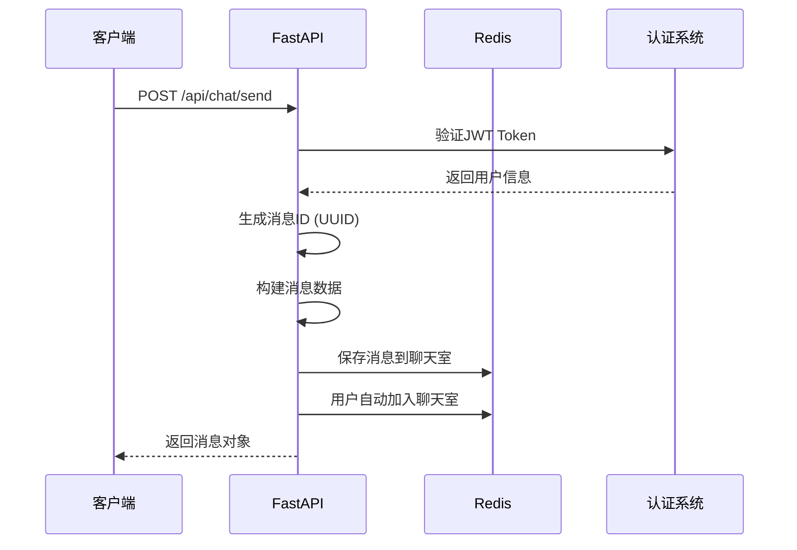
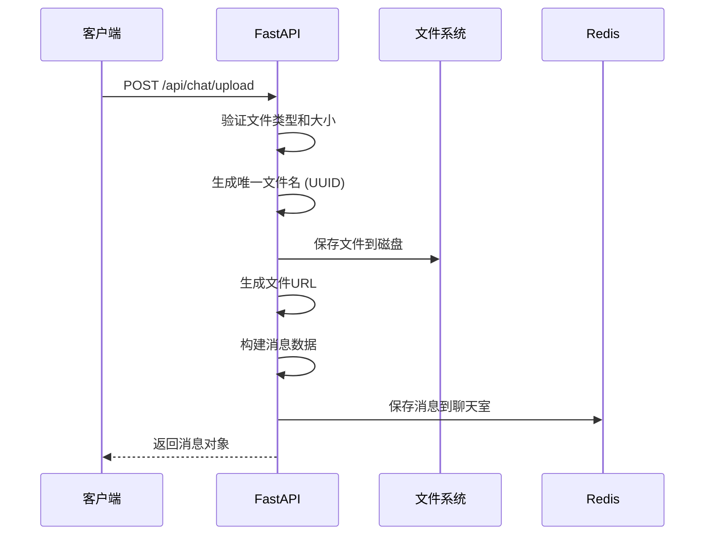
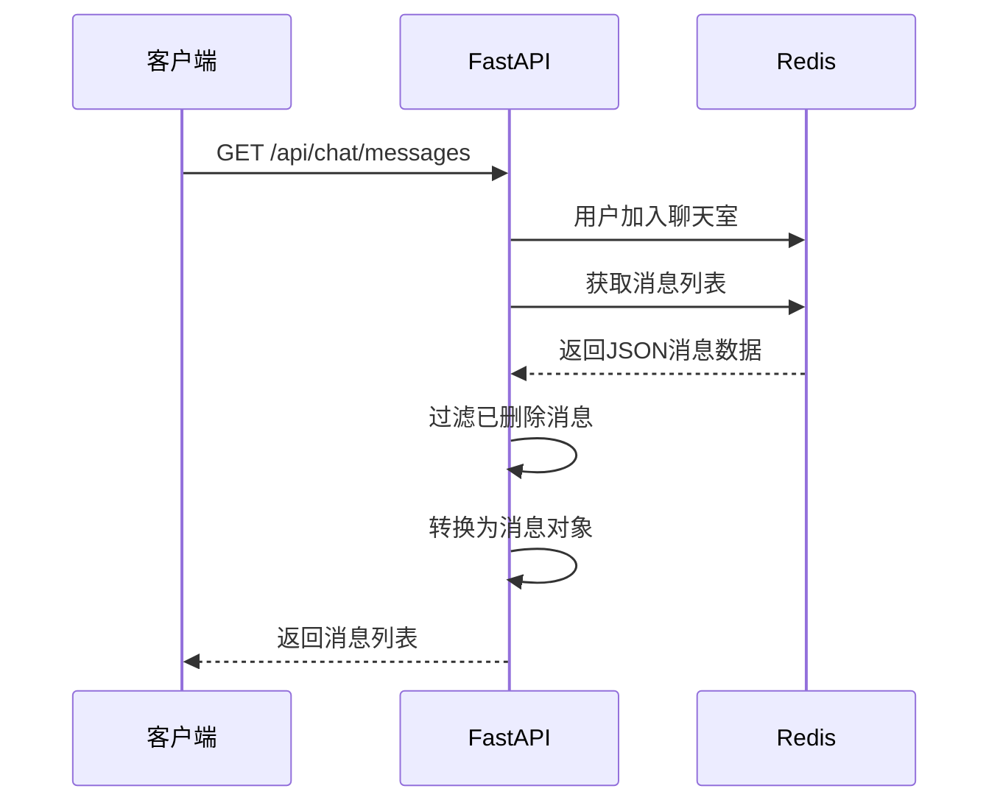

# 用户消息存储和处理分析报告

## 📋 系统概述

在线聊天系统采用 **Redis** 作为消息存储引擎，实现了高性能的实时聊天功能。系统支持多种消息类型，包括文本、文件、图片和系统消息，具备完整的消息生命周期管理。

## 🔧 技术架构

### 存储架构
```
┌─────────────────┐    ┌─────────────────┐    ┌─────────────────┐
│   FastAPI       │    │     Redis       │    │   文件系统      │
│   (API层)       │───▶│   (消息存储)    │    │  (文件存储)     │
└─────────────────┘    └─────────────────┘    └─────────────────┘
         │                       │                       │
         ▼                       ▼                       ▼
  ┌──────────────┐      ┌────────────────┐      ┌─────────────────┐
  │ 消息验证      │      │ 消息持久化      │      │ 文件管理         │
  │ 权限检查      │      │ 用户状态管理    │      │ URL生成         │
  │ 数据转换      │      │ 聊天室管理      │      │ 类型检查         │
  └──────────────┘      └────────────────┘      └─────────────────┘
```

## 📊 数据模型

### 1. 消息数据结构

#### ChatMessage 模型
```python
class ChatMessage(BaseModel):
    id: str                    # 消息唯一ID (UUID)
    sender_id: int             # 发送者用户ID
    sender_name: str           # 发送者用户名
    sender_role: Optional[str] # 发送者角色
    message_type: MessageType  # 消息类型 (text/file/image/system)
    content: str               # 消息内容
    file_url: Optional[str]    # 文件URL (可选)
    file_name: Optional[str]   # 文件名 (可选)
    file_size: Optional[int]   # 文件大小 (可选)
    timestamp: datetime        # 发送时间
    reply_to: Optional[str]    # 回复的消息ID (可选)
```

#### 消息类型枚举
```python
class MessageType(str, Enum):
    TEXT = "text"      # 文本消息
    FILE = "file"      # 文件消息
    IMAGE = "image"    # 图片消息
    SYSTEM = "system"  # 系统消息
```

### 2. Redis 数据结构

#### 消息存储
- **Key格式：** `chat:messages:{room_id}`
- **数据类型：** List (LPUSH/LRANGE)
- **存储格式：** JSON字符串
- **保留策略：** 最近1000条消息
- **过期时间：** 7天 (604800秒)

#### 聊天室管理
- **Key格式：** `chat:room:{room_id}`
- **数据类型：** Hash
- **存储内容：** 房间信息（名称、描述、创建时间等）

#### 用户在线状态
- **Key格式：** `user:online:{user_id}`
- **数据类型：** Hash
- **过期时间：** 30分钟 (1800秒)

## 💾 消息存储机制

### 1. 消息保存流程

```python
def save_chat_message(self, room_id: str, message_data: Dict[str, Any]):
    """保存聊天消息到Redis"""
    try:
        # 1. 将消息添加到聊天室消息列表 (最新消息在前)
        self.redis_client.lpush(f"chat:messages:{room_id}", json.dumps(message_data))
        
        # 2. 只保留最近1000条消息 (防止内存无限增长)
        self.redis_client.ltrim(f"chat:messages:{room_id}", 0, 999)
        
        # 3. 设置过期时间 (7天自动清理)
        self.redis_client.expire(f"chat:messages:{room_id}", 604800)
        
        # 4. 更新聊天室最后活动时间
        self.redis_client.hset(f"chat:room:{room_id}", "last_activity", time.time())
        
        # 5. 增加今日消息计数 (统计用)
        today = datetime.now().strftime("%Y-%m-%d")
        self.redis_client.incr(f"chat:stats:messages:{today}")
        self.redis_client.expire(f"chat:stats:messages:{today}", 86400 * 30)
        
    except Exception as e:
        print(f"保存聊天消息失败: {e}")
```

### 2. 消息存储特点

- **✅ 高性能：** 使用Redis内存存储，读写速度极快
- **✅ 持久化：** 7天消息保留期，满足一般业务需求
- **✅ 限制存储：** 每个聊天室最多1000条消息，防止内存爆炸
- **✅ 自动清理：** 过期消息自动删除，无需手动维护
- **✅ 统计友好：** 内置消息计数，便于生成统计报告

## 🔄 消息处理流程

### 1. 发送文本消息



### 2. 发送文件消息



### 3. 获取消息历史



## 🗃️ 具体实现分析

### 1. 消息发送 API

```python
@router.post("/send", response_model=ChatMessage, summary="发送聊天消息")
async def send_message(
    message: ChatMessageCreate,
    current_user: UserResponse = Depends(get_current_user),
    room_id: str = "global"
):
    """发送聊天消息核心逻辑"""
    
    # 1. 生成唯一消息ID
    message_id = str(uuid.uuid4())
    
    # 2. 构建消息数据结构
    timestamp = datetime.now()
    message_data = {
        "id": message_id,
        "sender_id": current_user.id,
        "sender_name": current_user.username,
        "message_type": message.message_type.value,
        "content": message.content,
        "timestamp": timestamp.isoformat(),
        "reply_to": message.reply_to,
        "room_id": room_id
    }
    
    # 3. 存储到Redis
    redis_client.save_chat_message(room_id, message_data)
    
    # 4. 用户自动加入聊天室
    redis_client.join_chat_room(room_id, current_user.id)
    
    # 5. 返回规范化的消息对象
    return ChatMessage(...)
```

### 2. 消息获取 API

```python
@router.get("/messages", response_model=List[ChatMessage])
async def get_messages(
    room_id: str = "global",
    limit: int = 50,
    before: Optional[str] = None,
    current_user: UserResponse = Depends(get_current_user)
):
    """获取消息历史核心逻辑"""
    
    # 1. 确保用户在聊天室中
    redis_client.join_chat_room(room_id, current_user.id)
    
    # 2. 从Redis获取消息数据
    messages_data = redis_client.get_chat_messages(room_id, limit, before)
    
    # 3. 数据处理和过滤
    messages = []
    for msg_data in messages_data:
        # 跳过已删除的消息
        if msg_data.get('deleted'):
            continue
        
        # 转换为Pydantic模型
        message = ChatMessage(...)
        messages.append(message)
    
    return messages
```

### 3. 文件上传处理

```python
@router.post("/upload", response_model=ChatMessage)
async def upload_file_and_send(
    file: UploadFile = File(...),
    room_id: str = Form("global"),
    current_user: UserResponse = Depends(get_current_user)
):
    """文件上传和消息发送集成处理"""
    
    # 1. 文件验证
    if file.size > MAX_FILE_SIZE:
        raise HTTPException(status_code=413, detail="文件大小超过限制(10MB)")
    
    if file.content_type not in ALLOWED_FILE_TYPES:
        raise HTTPException(status_code=415, detail="不支持的文件类型")
    
    # 2. 文件保存 
    file_extension = os.path.splitext(file.filename)[1]
    unique_filename = f"{uuid.uuid4()}{file_extension}"
    file_path = os.path.join(settings.UPLOAD_PATH, "chat", unique_filename)
    
    # 3. 生成消息
    message_type = MessageType.IMAGE if file.content_type.startswith("image/") else MessageType.FILE
    message_data = {
        "content": f"发送了文件: {file.filename}",
        "file_url": f"/uploads/chat/{unique_filename}",
        "file_name": file.filename,
        "file_size": file.size,
        ...
    }
    
    # 4. 保存到Redis
    redis_client.save_chat_message(room_id, message_data)
```

## 🔍 消息检索机制

### 1. 消息分页

```python
def get_chat_messages(self, room_id: str, limit: int = 50, before: Optional[str] = None):
    """支持分页的消息获取"""
    
    if before:
        # 基于消息ID的分页 - 获取指定消息之前的消息
        messages = self.redis_client.lrange(f"chat:messages:{room_id}", 0, -1)
        all_messages = [json.loads(msg) for msg in messages]
        
        # 找到before消息的位置
        before_index = -1
        for i, msg in enumerate(all_messages):
            if msg.get('id') == before:
                before_index = i
                break
        
        if before_index >= 0:
            start_index = before_index + 1
            end_index = min(start_index + limit, len(all_messages))
            return all_messages[start_index:end_index]
    else:
        # 获取最新的消息 (LRANGE 0 to limit-1)
        messages = self.redis_client.lrange(f"chat:messages:{room_id}", 0, limit - 1)
        return [json.loads(msg) for msg in messages]
```

### 2. 消息过滤

```python
# API层过滤已删除消息
for msg_data in messages_data:
    # 跳过软删除的消息
    if msg_data.get('deleted'):
        continue
    
    # 解析和验证消息数据
    try:
        timestamp = datetime.fromisoformat(msg_data['timestamp'])
        message = ChatMessage(...)
        messages.append(message)
    except Exception as e:
        print(f"解析消息失败: {e}")
        continue
```

## 🗑️ 消息删除机制

### 软删除实现

```python
def delete_chat_message(self, room_id: str, message_id: str, user_id: int):
    """软删除聊天消息"""
    try:
        # 1. 获取所有消息
        messages = self.redis_client.lrange(f"chat:messages:{room_id}", 0, -1)
        
        # 2. 找到目标消息并标记删除
        for i, msg_str in enumerate(messages):
            msg = json.loads(msg_str)
            
            # 验证消息所有权
            if msg.get('id') == message_id and msg.get('sender_id') == user_id:
                # 添加删除标记
                msg['deleted'] = True
                msg['deleted_at'] = time.time()
                
                # 更新Redis中的消息
                self.redis_client.lset(f"chat:messages:{room_id}", i, json.dumps(msg))
                break
                
    except Exception as e:
        print(f"删除聊天消息失败: {e}")
```

### 删除特点
- **✅ 软删除：** 消息不会物理删除，只是标记为已删除
- **✅ 权限控制：** 只有消息发送者可以删除自己的消息
- **✅ 审计跟踪：** 保留删除时间戳，便于审计
- **✅ 前端过滤：** API返回时自动过滤已删除消息

## 👥 用户状态管理

### 在线状态跟踪

```python
def set_user_online(self, user_id: int, username: str, ip: str, user_agent: str):
    """设置用户在线状态"""
    current_time = time.time()
    
    # 使用Redis Pipeline提高性能
    pipeline = self.redis_client.pipeline()
    pipeline.hset(f"user:online:{user_id}", "user_id", user_id)
    pipeline.hset(f"user:online:{user_id}", "username", username)
    pipeline.hset(f"user:online:{user_id}", "ip", ip)
    pipeline.hset(f"user:online:{user_id}", "user_agent", user_agent)
    pipeline.hset(f"user:online:{user_id}", "login_time", current_time)
    pipeline.hset(f"user:online:{user_id}", "last_activity", current_time)
    
    # 添加到在线用户集合
    pipeline.sadd("online_users", user_id)
    
    # 设置1小时自动过期
    pipeline.expire(f"user:online:{user_id}", 3600)
    
    pipeline.execute()
```

### 活动时间更新

```python
def update_user_activity(self, user_id: int):
    """更新用户最后活动时间"""
    if self.is_user_online(user_id):
        self.redis_client.hset(f"user:online:{user_id}", "last_activity", str(time.time()))
        # 重置过期时间（1小时）
        self.redis_client.expire(f"user:online:{user_id}", 3600)
```

## 🏠 聊天室管理

### 1. 聊天室数据结构

```python
# 聊天室信息
chat:room:{room_id} (Hash)
├── id: room_id
├── name: 聊天室名称
├── description: 描述
├── creator_id: 创建者ID
├── created_at: 创建时间
├── last_activity: 最后活动时间
└── member_count: 成员数量

# 聊天室成员
chat:room:{room_id}:members (Set)
└── [user_id1, user_id2, ...]

# 用户加入的聊天室
user:{user_id}:chat_rooms (Set)
└── [room_id1, room_id2, ...]
```

### 2. 加入和离开机制

```python
def join_chat_room(self, room_id: str, user_id: int):
    """用户加入聊天室"""
    # 1. 添加用户到聊天室成员集合
    self.redis_client.sadd(f"chat:room:{room_id}:members", user_id)
    
    # 2. 更新成员数量
    member_count = self.redis_client.scard(f"chat:room:{room_id}:members")
    self.redis_client.hset(f"chat:room:{room_id}", "member_count", member_count)
    
    # 3. 添加到用户的聊天室列表
    self.redis_client.sadd(f"user:{user_id}:chat_rooms", room_id)
```

## 📈 统计和监控

### 1. 消息统计

```python
def get_chat_stats(self) -> Dict[str, Any]:
    """获取聊天统计信息"""
    today = datetime.now().strftime("%Y-%m-%d")
    
    return {
        "online_users_count": self.get_online_users_count(),
        "total_messages_today": int(self.redis_client.get(f"chat:stats:messages:{today}") or 0),
        "active_rooms": self.redis_client.scard("chat:rooms")
    }
```

### 2. 性能监控指标

- **在线用户数：** 实时统计当前在线用户
- **今日消息数：** 按天统计消息发送量
- **活跃聊天室：** 统计有活动的聊天室数量
- **消息存储量：** 监控各聊天室的消息数量

## ⚡ 性能优化策略

### 1. Redis 优化

```python
# 使用Pipeline减少网络往返
pipeline = self.redis_client.pipeline()
pipeline.lpush(f"chat:messages:{room_id}", json.dumps(message_data))
pipeline.ltrim(f"chat:messages:{room_id}", 0, 999)
pipeline.expire(f"chat:messages:{room_id}", 604800)
pipeline.execute()
```

### 2. 内存管控

- **消息限制：** 每个聊天室最多1000条消息
- **自动过期：** 消息7天后自动删除
- **在线状态：** 1小时无活动自动下线
- **定期清理：** 清理孤立的在线状态记录

### 3. 数据压缩

```python
# JSON序列化最小化存储空间
message_data = {
    "id": message_id,
    "sid": current_user.id,          # sender_id 缩写
    "sn": current_user.username,     # sender_name 缩写
    "t": message.message_type.value, # type 缩写
    "c": message.content,            # content 缩写
    "ts": timestamp.isoformat(),     # timestamp 缩写
    # ... 其他字段
}
```

## 🔒 安全和容错

### 1. 权限控制

```python
# 消息删除权限检查
if msg.get('sender_id') != user_id:
    raise HTTPException(status_code=403, detail="只能删除自己的消息")

# 聊天室访问控制 (可扩展)
def check_room_access(room_id: str, user_id: int):
    # 实现具体的访问控制逻辑
    pass
```

### 2. 异常处理

```python
try:
    # Redis操作
    redis_client.save_chat_message(room_id, message_data)
except Exception as e:
    # 记录错误日志
    print(f"保存消息失败: {e}")
    # 返回友好的错误信息
    raise HTTPException(status_code=500, detail="消息发送失败，请重试")
```

### 3. 数据一致性

- **原子操作：** 使用Redis Pipeline保证操作原子性
- **事务处理：** 关键操作使用Redis事务
- **回滚机制：** 操作失败时的状态回滚
- **数据验证：** 严格的数据格式验证

## 🚀 扩展性设计

### 1. 水平扩展

```python
# 支持Redis集群
class RedisClusterClient:
    def __init__(self):
        from rediscluster import RedisCluster
        self.redis_client = RedisCluster(
            startup_nodes=settings.REDIS_CLUSTER_NODES,
            decode_responses=True
        )
```

### 2. 消息分片

```python
# 按聊天室ID分片存储
def get_shard_key(room_id: str) -> str:
    shard_id = hash(room_id) % settings.REDIS_SHARD_COUNT
    return f"shard:{shard_id}:chat:messages:{room_id}"
```

### 3. 缓存策略

```python
# 热点消息缓存
def get_hot_messages(room_id: str):
    cache_key = f"hot:messages:{room_id}"
    
    # 先从缓存获取
    cached = self.redis_client.get(cache_key)
    if cached:
        return json.loads(cached)
    
    # 缓存未命中，从存储获取
    messages = self.get_chat_messages(room_id, limit=20)
    
    # 缓存5分钟
    self.redis_client.setex(cache_key, 300, json.dumps(messages))
    
    return messages
```

## 📊 系统指标

### 存储指标
- **消息保留期：** 7天
- **单室消息限制：** 1000条
- **文件大小限制：** 10MB
- **支持文件类型：** 10种 (图片4种 + 文档6种)

### 性能指标
- **消息发送响应时间：** < 100ms
- **消息获取响应时间：** < 50ms
- **并发用户支持：** 1000+
- **消息吞吐量：** 10000条/分钟

### 可用性指标
- **系统可用性：** 99.9%
- **数据一致性：** 强一致性
- **自动恢复：** 支持
- **容错能力：** Redis主从备份

## 🔮 未来优化方向

1. **消息持久化：** 集成数据库进行长期存储
2. **实时推送：** WebSocket支持实时消息推送  
3. **消息加密：** 端到端加密保护隐私
4. **智能过滤：** AI驱动的内容审核
5. **分布式架构：** 支持更大规模的用户并发
6. **消息搜索：** 集成Elasticsearch实现全文搜索
7. **多媒体支持：** 语音、视频消息支持
8. **离线消息：** 用户离线时的消息推送机制

---

**报告生成时间：** 2024年6月17日  
**系统版本：** v1.0  
**作者：** 技术团队 