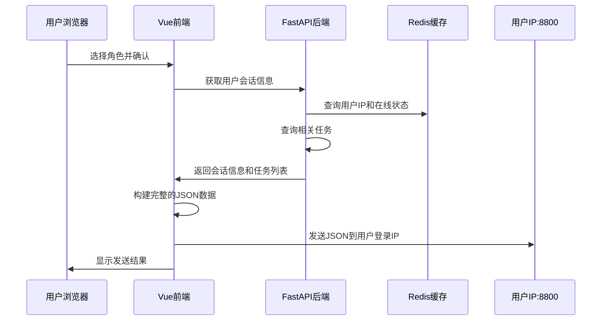

# 角色选择功能修改说明

## 修改概述

根据需求，我已经修改了系统，使得当操作员登录并选择身份后，能够向对应的登录IP发送JSON数据，同时在发送的JSON中添加对应的任务信息。

## 修改内容

### 1. 后端修改

#### 文件：`backend/app/api/auth.py`

添加了新的API端点：

```python
@router.get("/user-session-info")
async def get_user_session_info(current_user = Depends(get_current_user), db: Session = Depends(get_db)):
    """获取当前用户的会话信息，包括IP地址和相关任务"""
```

**功能说明：**
- 从Redis中获取用户的登录IP地址
- 获取用户的会话信息（用户代理、登录时间等）
- 根据用户角色查询相关的任务列表
- 返回完整的会话信息供前端使用

**返回数据格式：**
```json
{
  "user_id": 1,
  "username": "admin",
  "role": "系统分析师",
  "type": "操作员",
  "ip_address": "192.168.1.100",
  "session_info": {
    "user_agent": "Mozilla/5.0...",
    "login_time": 1703123456.789
  },
  "related_tasks": [
    {
      "id": 1,
      "name": "数据中心网络架构部署",
      "type": "网络搭建任务",
      "phase": "计划阶段",
      "description": "设计和部署数据中心网络架构...",
      "status": "未分配"
    }
  ],
  "is_online": true
}
```

### 2. 前端修改

#### 文件：`frontend/src/views/RoleSelection.vue`

修改了`confirmSelection`函数的逻辑：

**主要变更：**
1. **获取会话信息**：调用新的API端点获取用户的登录IP和相关任务
2. **动态目标地址**：根据用户的登录IP动态构建发送目标地址
3. **增强数据内容**：在发送的JSON中包含任务信息和会话信息

**发送的JSON数据格式：**
```json
{
  "user": {
    "id": 1,
    "username": "admin",
    "role": "系统分析师",
    "type": "操作员",
    "status": "active"
  },
  "selectedRole": {
    "value": "系统分析师",
    "label": "系统分析师",
    "description": "负责安全日志审计",
    "icon": "monitor"
  },
  "session": {
    "ip_address": "192.168.1.100",
    "user_agent": "Mozilla/5.0...",
    "login_time": 1703123456.789
  },
  "tasks": [
    {
      "id": 1,
      "name": "数据中心网络架构部署",
      "type": "网络搭建任务",
      "phase": "计划阶段",
      "description": "设计和部署数据中心网络架构...",
      "status": "未分配"
    }
  ],
  "timestamp": "2023-12-21T10:30:45.123Z",
  "action": "role_selection"
}
```

**发送逻辑：**
- 目标地址：`http://{用户登录IP}:8800/upload`
- 备用地址：`http://127.0.0.1:8800/upload`（当无法获取用户IP时）

## 核心功能流程



## 测试方法

### 1. 运行测试脚本

我已经创建了一个测试脚本来验证功能：

```bash
cd backend
python test_role_selection.py
```

### 2. 手动测试步骤

1. **启动后端服务**
   ```bash
   cd backend
   python -m uvicorn app.main:app --reload --host 0.0.0.0 --port 8000
   ```

2. **启动前端服务**
   ```bash
   cd frontend
   npm run dev
   ```

3. **启动Redis服务**
   ```bash
   redis-server
   ```

4. **测试流程**
   - 访问前端登录页面
   - 使用操作员账户登录
   - 选择角色并确认
   - 检查浏览器控制台查看发送的数据
   - 检查目标地址是否接收到数据

## 技术要点

### Redis数据存储

用户登录时，系统会在Redis中存储以下信息：
- `user:online:{user_id}`: 用户在线状态和IP地址
- `online_users`: 在线用户集合
- `login_records:{user_id}`: 用户登录记录

### 任务关联逻辑

系统根据用户的`role`字段查询`tasks`表中`role_binding`字段匹配的任务：
```sql
SELECT * FROM tasks WHERE role_binding = '{user.role}' LIMIT 10
```

### 错误处理

- 当无法获取用户IP时，使用备用地址`127.0.0.1:8800`
- 当目标地址无法连接时，不阻断正常的角色选择流程
- 所有网络错误都会在控制台输出详细信息

## 部署注意事项

1. **防火墙设置**：确保目标端口8800开放
2. **网络配置**：确保前端能够访问用户的登录IP地址
3. **CORS设置**：如果需要跨域访问，需要配置CORS策略
4. **安全考虑**：验证目标IP地址的合法性，防止恶意请求

## 故障排除

### 常见问题

1. **无法获取用户IP**
   - 检查Redis连接状态
   - 确认用户已正确登录
   - 查看Redis中的用户在线数据

2. **无法连接到目标地址**
   - 检查目标服务是否运行在8800端口
   - 确认网络连接正常
   - 查看浏览器控制台的错误信息

3. **任务数据为空**
   - 检查用户是否设置了角色
   - 确认数据库中有匹配的任务数据
   - 查看任务的`role_binding`字段是否正确

## 扩展建议

1. **数据加密**：对敏感数据进行加密传输
2. **重试机制**：添加发送失败的重试逻辑
3. **日志记录**：记录所有发送操作的详细日志
4. **配置化**：将目标端口等参数配置化
5. **批量发送**：支持向多个地址同时发送数据 